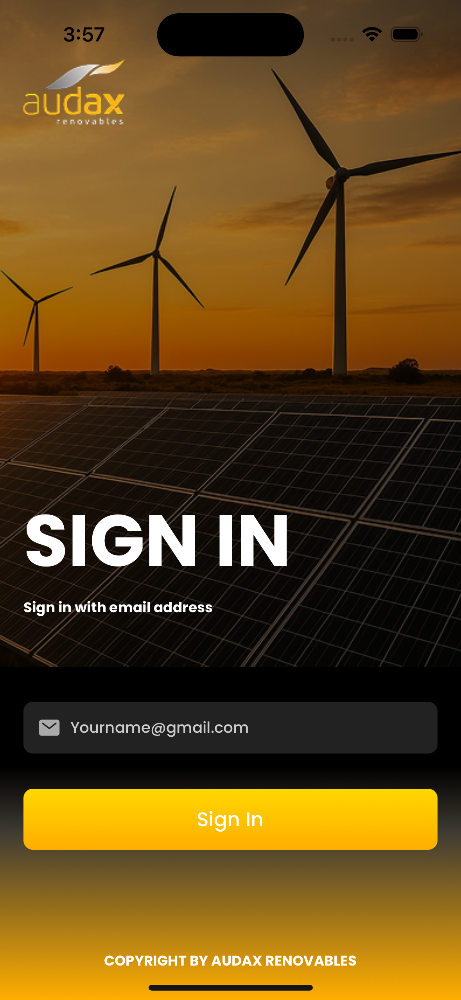
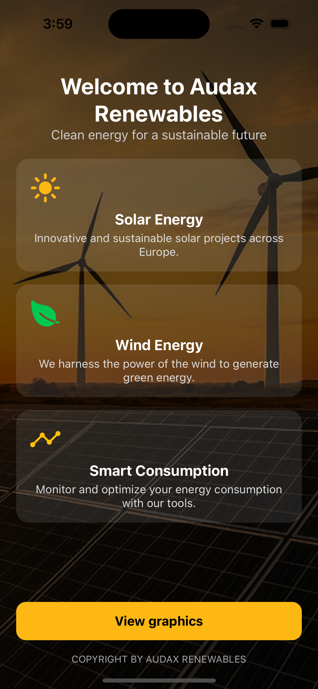
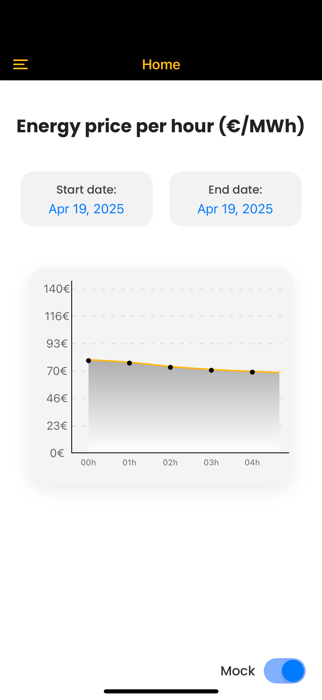
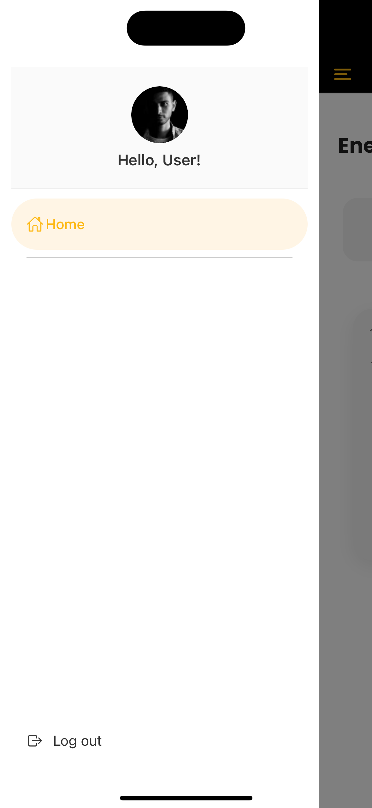

# 📱 Audax Mobile

**Audax Mobile** es una aplicación móvil construida con **React Native**, utilizando **Expo** y **expo-router**. Este proyecto implementa navegación estructurada, consumo de APIs GraphQL mediante Apollo Client, y una arquitectura modular que facilita el mantenimiento y escalabilidad.

---

## 🚀 Instalación

1. Clona el repositorio:

```bash
git clone https://github.com/estivenm/audax-mobile.git
cd audax-mobile
```

2. Instala las dependencias:

```bash
npm install
```

> Asegúrate de tener `Node.js`, `npm`, y `expo-cli` instalados globalmente.

---

## 🧪 Ejecutar Pruebas Unitarias

El proyecto utiliza **Jest** junto con **Testing Library** para pruebas unitarias.

```bash
npm test
```

---

## 📱 Ejecutar el Proyecto

### 🔁 Iniciar el servidor

```bash
npm start
```

### 📱 Ejecutar en Android

```bash
npm run android
```

### 🍏 Ejecutar en iOS

```bash
npm run ios
```

> iOS solo disponible en macOS con Xcode instalado.

### 🌐 Ejecutar en Web

```bash
npm run web
```

---

## 📲 Probar la app en tu dispositivo

1. Instala **Expo Go** desde la [App Store (iOS)](https://apps.apple.com/app/expo-go/id982107779) o [Google Play (Android)](https://play.google.com/store/apps/details?id=host.exp.exponent).
2. Abre este enlace desde el navegador de tu dispositivo o escanéalo con la cámara para abrirlo directamente en Expo Go:

🔗 [Abrir App en Expo Go](https://expo.dev/preview/update?message=Add%20energy%20price%20models%2C%20error%20handling%2C%20and%20enhance%20dashboard%20%20start%20date%2C%20endDate%20and%20update%20readme&updateRuntimeVersion=1.0.0&createdAt=2025-04-24T07%3A55%3A49.838Z&slug=exp&projectId=9c938fb3-2cd4-4372-b564-6cf689e46ab1&group=5d0e7b3f-ef4f-434a-a566-1e9fae475b08)


> Esta URL abre una vista previa de la aplicación directamente en Expo Go. Ideal para pruebas sin necesidad de emuladores o compilación local.

📱 [APK](https://expo.dev/accounts/estivenmazo/projects/audax-mobile/builds/16ea552e-1111-40db-9dc6-cd8d840aa074)
---

## 🧩 Tecnologías Usadas

- **React Native**
- **Expo & expo-router**
- **Apollo Client & GraphQL**
- **Zustand (estado global)**
- **Jest + Testing Library (pruebas)**
- **TypeScript**

---

## 📁 Estructura del Proyecto

```
.
├── __tests__               # Pruebas unitarias
│   ├── components
│   ├── features
│   │   └── dashboard/hooks
│   └── hooks/useFonts.test.tsx
├── app                     # Rutas principales (expo-router)
│   ├── _layout.tsx
│   ├── auth/login.tsx
│   ├── dashboard
│   │   ├── _layout.tsx
│   │   └── dashboardScreen.tsx
│   └── welcome/welcomeScreen.tsx
├── assets                  # Imágenes y recursos estáticos
│   └── images
├── components              # Componentes reutilizables
│   ├── CustomDrawer.tsx
│   ├── SplashLoading.tsx
│   └── energyChart.tsx
├── features                # Lógica de negocio y UI modularizada
│   └── dashboard/hooks/useEnergyData.tsx
├── hooks                   # Hooks personalizados
│   └── useFonts.tsx
├── httpClient              # Configuración de Apollo Client
│   └── apolloClient.tsx
│   └── queries.tsx
├── app.json                # Configuración de Expo
├── babel.config.js
├── jest.config.js
├── tsconfig.json
└── package.json
```

---

## 📜 Scripts Disponibles

| Comando             | Descripción                                     |
|---------------------|-------------------------------------------------|
| `npm start`         | Inicia el servidor Expo                         |
| `npm run ios`       | Ejecuta la app en simulador iOS                 |
| `npm run android`   | Ejecuta en emulador Android                     |
| `npm run web`       | Ejecuta en navegador (modo web)                 |
| `npm test`          | Ejecuta las pruebas unitarias                   |
| `npm run build:android` | Genera `.apk` con EAS Build               |
| `npm run build:ios`     | Genera `.ipa` con EAS Build               |
| `npm run build:all`     | Genera build para Android e iOS           |

---

## 🏗️ Generar Builds de Producción

Este proyecto utiliza **EAS Build** para generar versiones de producción para Android (`.apk`) e iOS (`.ipa`).

### 🔧 Requisitos Previos

Instala `eas-cli` si aún no lo tienes:

```bash
npm install -g eas-cli
```

Inicializa EAS en tu proyecto:

```bash
eas init
```

---

### 📲 Android `.apk`

Genera un archivo `.apk` ejecutable directamente en dispositivos Android:

```bash
npm run build:android
```

📱 [APK](https://expo.dev/accounts/estivenmazo/projects/audax-mobile/builds/16ea552e-1111-40db-9dc6-cd8d840aa074)

---

### 🍏 iOS `.ipa`

Compila un archivo `.ipa` para dispositivos Apple:

```bash
npm run build:ios
```

> Requiere macOS y una cuenta de Apple Developer.

---

## Pantallas

### Login


### Welcome



### Dashboard


### Menu



## 📄 Licencia

Este proyecto es **privado** y no está licenciado para distribución pública.

---
